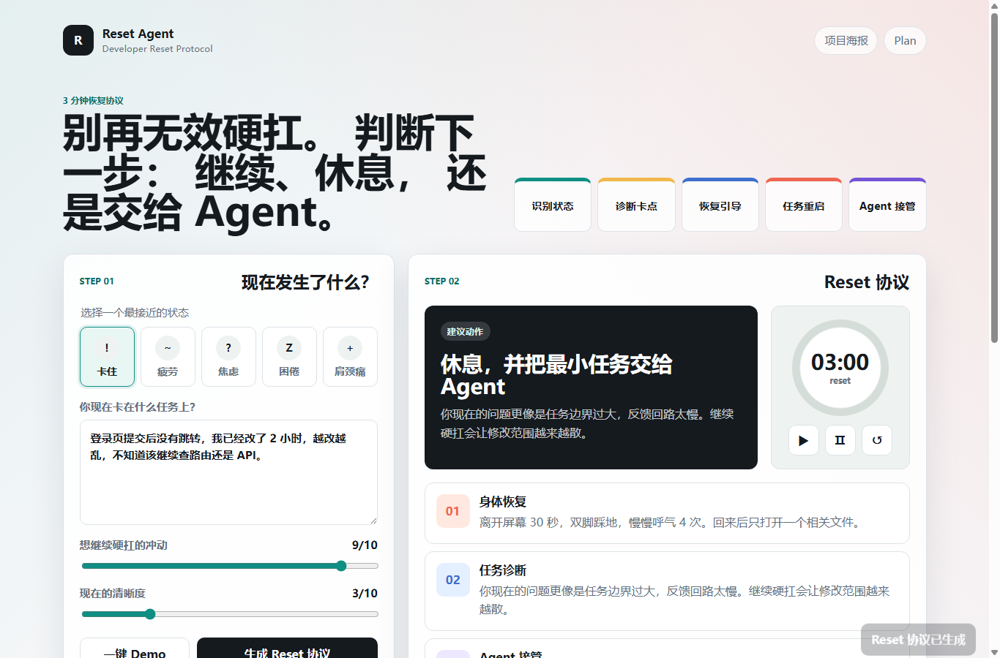
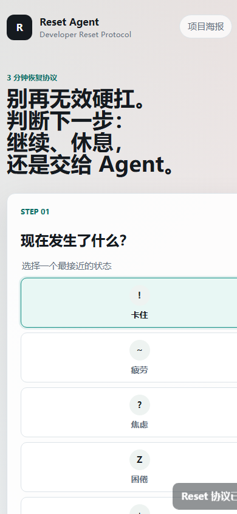
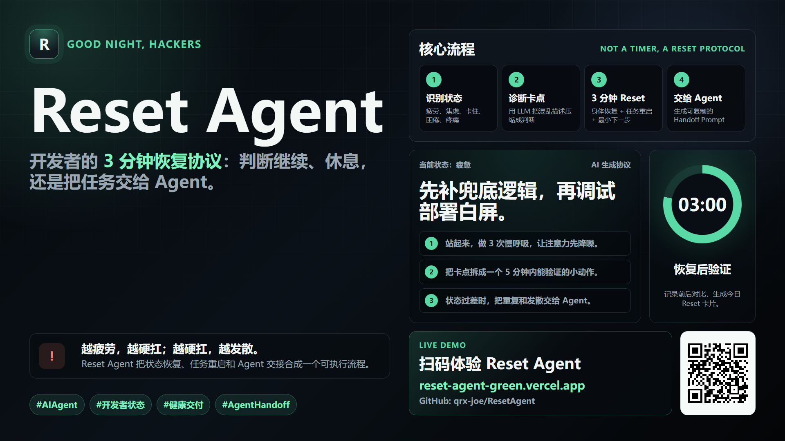

# Reset Agent

开发者的 3 分钟状态恢复协议。它在你疲劳、焦虑、卡住或准备无效硬扛时，帮你判断下一步应该继续、休息，还是把任务交给 Agent。

## 项目亮点

- **Developer Reset Protocol**：状态选择 → 任务诊断 → 恢复引导 → 任务重启 → 前后验证。
- **Agent Handoff**：状态过差时生成可复制给 Codex / Cursor / Claude Code 的任务交接 Prompt。
- **任务感知诊断**：规则引擎会分析你输入的任务内容（关键词、长度、上下文），给出更精准的诊断，而不是千人一面的模板。
- **API 预留层**：已封装好 LLM 调用接口，填入端点和密钥即可从规则引擎升级到真实模型，无需重构代码。
- **零后端 MVP**：纯静态页面即可运行，核心数据保存在浏览器本地。

## 技术架构

```
├── index.html          — 单页应用入口
├── app.js              — UI 层（ES Module）
├── js/
│   └── protocol-engine.js — 协议生成引擎（规则引擎 + API 预留层）
├── styles.css          — 全部样式
├── poster.html         — 项目海报页面
├── serve.js            — 本地开发服务器
├── docs/
│   └── PLAN.md         — 原始项目计划
└── assets/             — 截图资源
```

### 协议生成双模式

`js/protocol-engine.js` 提供两种协议生成方式：

1. **规则引擎（默认）**：零依赖、零延迟，根据状态类型 + 任务内容启发式分析生成协议。
2. **API 模式（预留）**：配置 `API_ENDPOINT` 和 `API_KEY` 后启用，自动 fallback 到规则引擎。

在浏览器控制台即可切换：

```javascript
import { updateConfig } from './js/protocol-engine.js';
updateConfig({
  ENABLE_API: true,
  API_ENDPOINT: 'https://dashscope.aliyuncs.com/compatible-mode/v1/chat/completions',
  API_KEY: '你的密钥',
  MODEL: 'qwen-turbo'
});
```

## 本地运行

推荐使用本地服务器（ES Module 在 `file://` 协议下可能受限）：

```bash
node serve.js
```

然后访问：

```text
http://localhost:4173
```

一键 Demo：

```text
http://localhost:4173/?demo=1
```

## 截图







## 提交物

- 可运行网站：`index.html`
- 项目海报：`poster.html` / `assets/poster.png`
- 项目计划：[docs/PLAN.md](./docs/PLAN.md)

## 后续可接入

- [x] 规则引擎任务感知分析（已实现）
- [x] API 预留层 + fallback 机制（已实现）
- [ ] 接入通义千问 / OpenAI 真实模型（需配置密钥）
- [ ] Vercel 部署，把 Demo 链接换成线上地址
- [ ] 真实健康数据输入，例如 Apple Watch / Oura / WHOOP 的恢复状态
